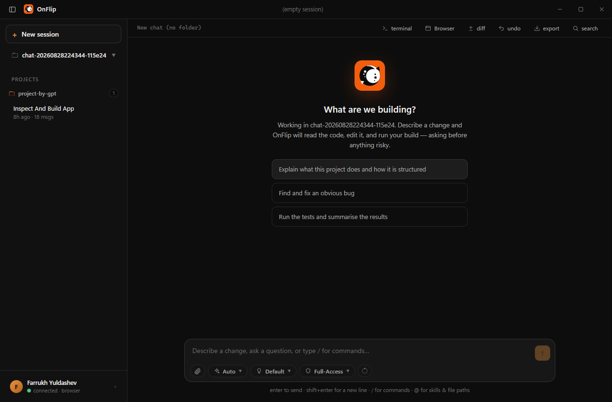

<div align="center">


# OnFlip

**An agent for coding and everyday tasks, powered by your own ChatGPT account.**

No API key. No per-token billing. On ChatGPT's free plan, no bill at all.

[](https://github.com/khudayarovich/onflip-agent/releases/latest)
[](https://github.com/khudayarovich/onflip-agent/actions/workflows/ci.yml)
[](LICENSE)
[](https://github.com/khudayarovich/onflip-agent/releases/latest)
[](#support-the-project)



</div>

## Why an agent on a chat subscription

One task is never one message. "Fix this failing test" is a dozen or more: read
the file, run the build, read the error, edit, run it again. That multiplication
is what makes API-priced agents expensive — every step is billed.

OnFlip is not priced per step, because it does not use the API. It drives the
ChatGPT session you are already signed in to, so an agent that works all
afternoon costs exactly what your account already costs:

> **On the Free and Go plans, that is nothing.** In August 2026 OpenAI made
> **GPT-5.6 Luna** the default for Free and Go users and
> [removed the daily cap on text chats entirely](https://techcrunch.com/2026/08/06/openai-brings-unlimited-chatgpt-text-chats-to-free-users/) —
> unlimited messages, on a model that makes
> [62% fewer factual errors than Instant](https://openai.com/index/improving-gpt-5-6-sol-in-chatgpt/).
> An agent's dozens-of-messages-per-task appetite stops being a cost at all.
>
> **On Plus and Pro**, the same app runs on **GPT-5.6 Sol** and its far larger
> context window — OnFlip reads your plan and the model's window and sizes its
> own context budget to match, so long sessions summarise themselves far less
> often.

The honest caveat: unlimited covers *text*. Free accounts still have limits on
file uploads, which OnFlip uses to hand over unusually large turns, so very
long sessions go further on a paid plan.

## What it is

OnFlip is a desktop app that turns a ChatGPT account into a working agent. It
reads and edits files on your computer, runs commands, browses the web, and
produces documents — asking your approval before anything risky.

Everything happens on your machine. There is no OnFlip server, no telemetry, and
no account to create: the app talks to ChatGPT through your own browser session
and to nothing else.

## Install

Download the latest build from the [releases page](https://github.com/khudayarovich/onflip-agent/releases/latest).

| Platform | File | Notes |
| --- | --- | --- |
| Windows 10/11 | `OnFlip-Setup-<version>.exe` | Updates in place; settings and sessions are kept. SmartScreen warns because the build is unsigned — *More info → Run anyway*. |
| macOS (Apple Silicon) | `OnFlip-<version>-mac-arm64.dmg` | Drag to Applications. First launch needs **right-click → Open → Open**. |
| macOS (Intel) | `OnFlip-<version>-mac-x64.dmg` | Same as above. |

On first launch OnFlip asks you to sign in to ChatGPT. If you are already signed in to ChatGPT in a browser whose cookies it can read, it picks that session up and you never see a login form.

## What it can do

- **Work in a project folder.** Open a directory and describe a change. OnFlip reads the code, edits it, runs your build or tests, and reports what actually happened — never what it imagines happened.
- **Work with no folder at all.** Start a chat without a project and ask for a document, a spreadsheet, a script. Files it produces appear in the transcript with **Save** and **Open** buttons.
- **Run commands.** A real shell, behind an approval layer you control — from read-only through to unrestricted.
- **Browse.** A real browser you can watch *and touch*: click, scroll and type into the page the agent is driving, then hand it back.
- **Two sessions at once.** Each window runs its own agent with its own browser, the way two ChatGPT tabs are two conversations.
- **Undo and inspect.** Every file change is snapshotted: see the diff for the session, revert the last change, export the transcript.

## Support the project

OnFlip is free, MIT-licensed, and built in the open by one person. It has no
paid tier and collects nothing from you — if it saves you time, a contribution
keeps it maintained.

<table>
<tr>
<td width="60%" valign="top">

**Ways to help**

- ⭐ **Star the repository** — free, and the single biggest help
- 🐛 **Report bugs** with a log excerpt, or suggest a feature
- 💛 **Sponsor** if OnFlip earns a place in your workflow

</td>
<td width="40%" valign="top">

**Donate**

[](https://github.com/sponsors/khudayarovich)

[](https://buymeacoffee.com/khudayarovich)

</td>
</tr>
</table>

## Approval modes

Every side effect passes through one policy, chosen per session:

| Mode | Behaviour |
| --- | --- |
| **Read-Only** | Reads and searches. Nothing is changed. |
| **Ask First** | Every write and every command needs your approval. |
| **Auto-Edit** | Edits inside the workspace run freely; commands still ask. |
| **Full-Access** | Runs everything except destructive commands. |
| **Unrestricted** | Runs everything, including destructive commands. |

Approvals can be granted once or remembered as a rule (`git *` allowed, `rm *` denied), and rules are per command pattern rather than per session.

## How it works

```
┌──────────────┐     ndjson RPC     ┌───────────────┐    Playwright    ┌──────────┐
│  Electron UI │ ◄────────────────► │ engine (Node) │ ◄──────────────► │ ChatGPT  │
└──────────────┘                    └───────────────┘                  └──────────┘
                                            │
                                       tools│ files · shell · browser · web
                                            ▼
                                     your computer
```

The renderer draws; it never touches your files. The **engine** is a separate Node process that owns the agent loop, the tools and the approval policy. It talks to ChatGPT by driving a real browser session — the same pages you would use yourself — and turns replies into tool calls it executes locally.

One window pairs with one engine, which is what makes two concurrent sessions genuinely independent.

There is no OnFlip server. Nothing is sent anywhere except to ChatGPT, by your own browser session.

## Your data

- **Your ChatGPT session** is stored on your machine (`~/.onflip`) and used only to talk to ChatGPT.
- **Conversations** are plain JSON on disk, readable and deletable by hand.
- **Files** are read and written where you point the agent; nothing is uploaded anywhere else.
- **Chats OnFlip creates** on chatgpt.com are filed into an "OnFlip" project so they stay out of your main list, and deleting a session offers to delete them too.

## Frequently asked

**Does this break ChatGPT's terms?** OnFlip drives a real browser session as a logged-in user, with no automation flags and no bypassing of any check — Cloudflare challenges are completed by you, in a real window. You are responsible for using your account within OpenAI's terms.

**Why can't it use my Chrome session?** Chrome and Edge on Windows encrypt their cookies so that no other program can read them, and recent Chrome refuses to be driven with its own profile. Both are deliberate anti-theft protections and OnFlip does not work around them. Sign in through the app's window once — it remembers — or sign in to ChatGPT in Firefox, whose session OnFlip can read directly.

**Which model does it use?** Whatever your account offers, chosen from the model chip. Free and Go accounts default to GPT-5.6 Luna, the plan with unlimited text chats; Plus and Pro run GPT-5.6 Sol in regular chat. Reasoning effort is a separate control, and OnFlip sizes its context budget from whichever model you are on.

**Does it cost anything per message?** No. There is no API key and nothing metered — the work costs whatever your ChatGPT account costs, which on the Free and Go plans is nothing. Limits still apply to things that are not plain text (image generation, file uploads), and when ChatGPT throttles an account OnFlip waits it out rather than hammering it.

**Do I need a paid plan?** No. A free account runs the agent, and unlimited text chats suit an agent workload of many small messages. A paid plan buys a much larger context window, so long sessions compact themselves less often.

## Building from source

Requires Node.js 20+.

```bash
git clone https://github.com/khudayarovich/onflip-agent.git
cd onflip-agent
npm install                 # builds the engine
cd desktop && npm install
npm start                   # builds and launches the app
```

To produce installers, see [RELEASING.md](RELEASING.md).

## Contributing

Bug reports and pull requests are welcome — see [CONTRIBUTING.md](CONTRIBUTING.md). Security issues have [their own process](SECURITY.md).

## License

[MIT](LICENSE) © Farrukh Khudayarovich Yuldashev

OnFlip is an independent project. It is not affiliated with, endorsed by, or sponsored by OpenAI.
